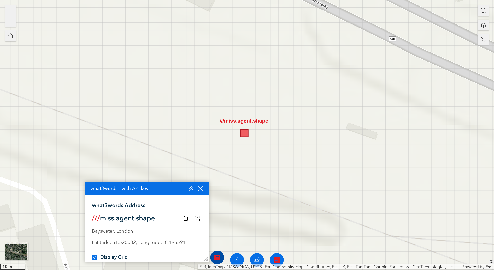
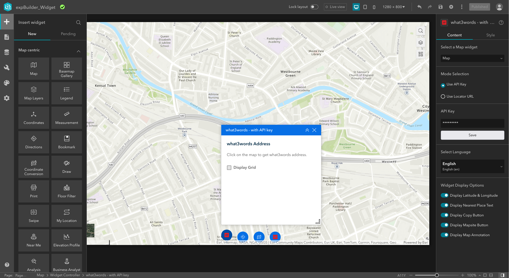
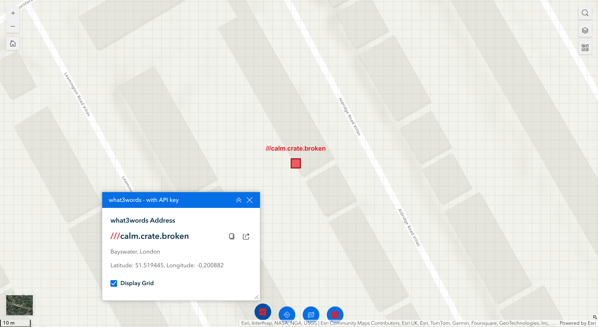
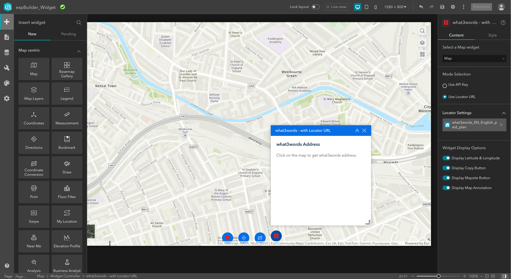
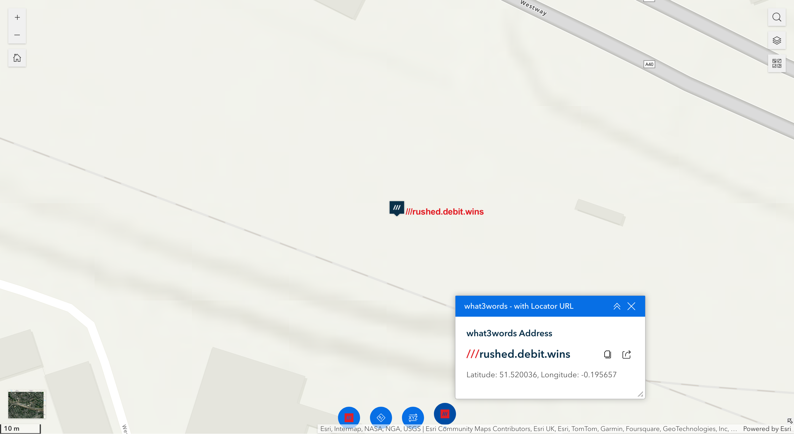
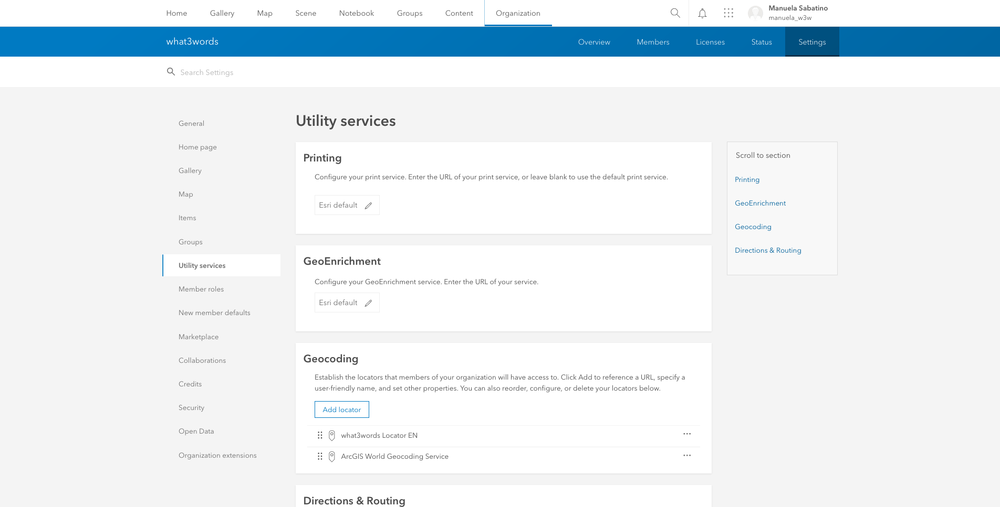

# <image src="https://what3words.com/assets/images/w3w_square_red.png" width="32" height="32"> &nbsp; what3words ArcGIS Experience Builder Widget

A custom widget for [ArcGIS Experience Builder](https://developers.arcgis.com/experience-builder//) providing reverse geocoding via the [what3words ArcGIS locator](https://developer.what3words.com/tools/gis-extensions/arcgis) and the what3words API key. By using the what3words API key you will be able to display the what3words Grid.

## Demo App

You can find the Custom Web AppBuilder what3words widget in this [Github page](https://what3words.github.io/w3w-arcgis-experience-builder-widget/expBuilder_Widget/).

## Prerequisites
- An installed and configured instance of [ArcGIS Experience Builder (Developer Edition)](https://developers.arcgis.com/experience-builder/guide/install-guide/);
- A URL of your what3words ArcGIS Locator that has been added to your ArcGIS online or your Portal for ArcGIS by following this [instruction](https://developer.what3words.com/tools/gis-extensions/arcgis) on the what3words developer site;
- A copy of this widget `what3words`.

## Installation and Configuration

- Deploy the widget by copying the `what3words` folder and its contents into your ArcGIS Experience Builder installation's `client/your-extensions/widgets/` folder and restart your watcher;

- Run both [ArcGIS Experience Builder server](https://developers.arcgis.com/experience-builder/guide/install-guide/#server-install) and [ArcGIS Experience Builder client](https://developers.arcgis.com/experience-builder/guide/install-guide/#client-install) in 2 separate terminals;

- Create your [own Experience Application](https://developers.arcgis.com/experience-builder/guide/);

- Create your own experience application with a base map. You can now add the what3words widget to the map, on the side or whichever you prefer. You can search the `what3words` widget by typing its name on the search bar at the top of the list of widgets or looking for the widget on the list.

- Once you have found it you can drag and drop the widget onto your application whichever you prefer, next to map, on top of it or at the bottom of it. 
On the widget you can display the what3words address, the coordinates in WGS84, the copy and mapsite buttons, and the map annotation of the address. 
On the Content panel of the widget on the right hand side, you have 3 sections:
    1. Select a map that you want your widget to work on;
    2. Select your `Mode Selection` by using the:
        - `what3words API key`:
        If you choose the API key, you need to `enter your what3words API key`. Click `Save` and then choose your `what3words language`.
        - or `what3words Locator URL`:
        If you choose the locator URL, you can `Select Utility`. Search among your locators on your ArcGIS Online account and pick the one you want to use.
    3. Display some widget options:
        - The Latitude & Longitude coordinates options allows you to display the WGS84 coordinates of the related what3words address;
        - The Copy button allows you to copy the what3words to your clipboard;
        - The Mapsite button allows you to open the what3words address to the mapsite www.what3words.com;
        - The Map Annotation allows you to display the label of the what3words address next to the marker;
        - The Nearest Place Text is only available if you choose the API mode and displays the nearest places for that what3words address.

### API mode

#### Display what3words Grid
When users select the API mode, a checkbox `Display Grid` is shown on the what3words widget. If checked, users will be able to display the grid while panning around the map. The what3words grid is added to the map as a layer and visible within the Group of Layers if this feature is enabled on the basemap.
The grid will be displayed only at zoom levels where the what3words squares are appropriately visible within the grid.

### Locator URL mode

- Configure the widget with your `what3words Locator URL`. By using the what3words locator, you would be able to retrieve the correct what3words address in any coordinate systems used on your web map.
Example of a what3words Locator: `https://utility.arcgis.com/usrsvcs/servers/<MyGeocodingArcGISUniqueID>/rest/services/what3words_EN_English/GeocodeServer`.

- To find the what3words Locator URL, go to your ArcGIS Online or Portal for ArcGIS, click on the `Content > My Organization` tab. Search for your locator, you could filter by `Item type > Tools > Locators` as shown on this screenshot:

- Then click on your Locator, scroll down to the bottom of the page, on the right-hand side, you will find the URL of your Locator. You need to *copy and paste this URL to the configuration page of the what3words widget*, as shown on this screenshot:

- The widget is now ready to run inside your Experience Builder app. Click on the map to retrieve the what3words address at the clicked location. For example, the point selected on the map returned this what3words address: `///filled.count.soap`.

## Troubleshooting
If after installing correctly the what3words locator across your ArcGIS platform, you cannot display your what3words locator on your Experience app, it could be that your what3words locator hasn’t been put at the top of your `Geocoding services`.

To resolve this issue, please drag-and-drop the what3words locator at the top of the Geocoding service list, as it is shown on this screenshot. You can find this list under your `Organisation > Utility services > Geocoding section`. 

## Issues

Find a bug or want to request a new feature? Please let us know by submitting an issue.

## Contributing
All contributions are welcome; please submit a pull request.

1. Fork it (http://github.com/what3words/w3w-arcgis-experience-builder-widget.git and click "Fork")
1. Create your feature branch (`git checkout -b my-new-feature`)
1. Commit your changes (`git commit -am 'Add some feature'`)
1. Don't forget to update README and bump [version](./lib/what3words/version.rb) using [semver](https://semver.org/)
1. Push to the branch (`git push origin my-new-feature`)
1. Create new Pull Request

## Revision History
* `v1.0.0` - Add the locator to the ArcGIS Experience Builder
* `v1.0.2` - Add a temporary fix to validate any Locator URLs
* `v1.0.3` - Publish the app on a web server
* `v1.0.4` - Fix bug - What3words widget can be displayed on maps with layers
* `v1.0.5` - update offset marker and label on the map to the actual location of the point
* `v1.0.6` - Fix the issue of retrieving null what3wrods at first tap on the map.Compatible to exp builder v1.15
* `v1.1.0` - New UI, add API key mode and new features
* `v1.2.0` - Add Grid, Support dark/light mode, major refactor and restructure of the app

## Feedback

We have a quick favor to ask. Would you mind heading to our app in the [what3words ArcGIS Online page](https://w3w.maps.arcgis.com/home/item.html?id=0150cfda08334003bec3a77e1006e8c6#overview) and writing a quick review?

Reviews help us keep up with your needs and they also help others like you to make confident decisions about our what3words applications.

Review or not, we still love you!

## Licensing

This widget is licensed under the MIT license. A copy of the license is available in the repository's [license](https://github.com/what3words/w3w-arcgis-webappbuilder-widget/blob/master/LICENSE) file.

