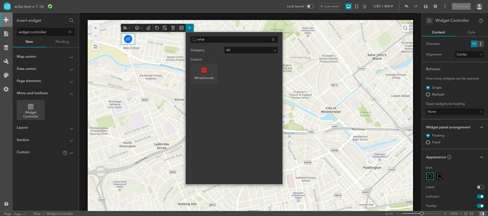

# <image src="https://what3words.com/assets/images/w3w_square_red.png" width="32" height="32"> &nbsp; what3words ArcGIS Experience Builder Widget

A custom widget for [ArcGIS Experience Builder](https://developers.arcgis.com/experience-builder//) providing reverse geocoding via the [what3words ArcGIS locator](https://developer.what3words.com/tools/gis-extensions/arcgis).

## Prerequisites
- An installed and configured instance of [ArcGIS Experience Builder (Developer Edition)](https://developers.arcgis.com/experience-builder/guide/install-guide/);
- A URL of your what3words ArcGIS Locator that has been added to your ArcGIS online or your Portal for ArcGIS by following this [instruction](https://developer.what3words.com/tools/gis-extensions/arcgis) on the what3words developer site;
- A copy of this widget `what3words`.

## Installation and Configuration

- Deploy the widget by copying the `what3words` folder and its contents into your ArcGIS Experience Builder installation's `client/your-extensions/widgets/` folder and restart your watcher;

- Run both [ArcGIS Experience Builder server](https://developers.arcgis.com/experience-builder/guide/install-guide/#server-install) and [ArcGIS Experience Builder client](https://developers.arcgis.com/experience-builder/guide/install-guide/#client-install) in 2 separate terminals;

- Create your [own Experience Application](https://developers.arcgis.com/experience-builder/guide/);

- Create your own experience application with a base map. You can now add the what3words widget to the map, on the side or whichever you prefer. You can search the `what3words` widget by typing its name on the search bar at the top of the list of widgets or looking for the widget on the list.

- Once you have found it you can drag and drop the widget onto your application whichever you prefer, next to map, on top of it or at the bottom of it. 
On the widget you can display the what3words address, the coordinates in WGS84, the zoom and copy buttons. 
On the Content panel of the widget on the right hand side, you have 3 sections:
    1. Select a map that you want your widget to work on;
    2. Set the what3words locator. Click on `Set Locator` and you will be able to select your what3words locator from the ArcGIS Online or your Portal for ArcGIS. 
    3. Display some widget options:
        - The Lat/Long coordinates options allows you to display the WGS84 coordinates of the related what3words address;
        - The Zoom button allows you to get to 5000m closer to the point on the map;
        - The Copy button allows you to copy the what3words to your clipboard;
        - With Popup message enabled you can display a popup message with the what3words address info above the map marker after tapping anywhere on the map.

- Configure the widget with your `what3words Locator URL`. By using the what3words locator, you would be able to retrieve the correct what3words address in any coordinate systems used on your web map.
Example of a what3words Locator: `https://utility.arcgis.com/usrsvcs/servers/<MyGeocodingArcGISUniqueID>/rest/services/what3words_EN_English/GeocodeServer`.

- To find the what3words Locator URL, go to your ArcGIS Online or Portal for ArcGIS, click on the `Content > My Organization` tab. Search for your locator, you could filter by `Item type > Tools > Locators` as shown on this screenshot:

- Then click on your Locator, scroll down to the bottom of the page, on the right-hand side, you will find the URL of your Locator. You need to *copy and paste this URL to the configuration page of the what3words widget*, as shown on this screenshot:

- The widget is now ready to run inside your Experience Builder app. Click on the map to retrieve the what3words address at the clicked location. For example, the point selected on the map returned this what3words address: `///filled.count.soap`.

## Issues

Find a bug or want to request a new feature? Please let us know by submitting an issue.

## Contributing
All contributions are welcome; please submit a pull request.

1. Fork it (http://github.com/what3words/w3w-arcgis-experience-builder-widget.git and click "Fork")
1. Create your feature branch (`git checkout -b my-new-feature`)
1. Commit your changes (`git commit -am 'Add some feature'`)
1. Don't forget to update README and bump [version](./lib/what3words/version.rb) using [semver](https://semver.org/)
1. Push to the branch (`git push origin my-new-feature`)
1. Create new Pull Request

## Revision History
* `v1.0.0`  - Add the locator to the ArcGIS Experience Builder

## Licensing

The MIT License (MIT)

A copy of the license is available in the repository's [license](LICENSE.txt) file.

